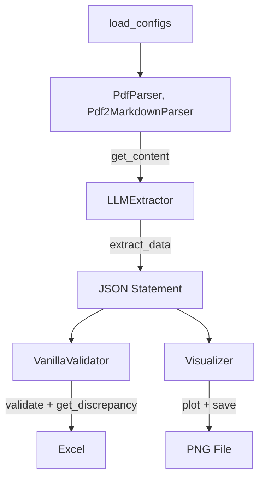

# Bank Statement Analyzer

Automate the **extraction, validation, and visualisation** of bank-statement PDFs.
1. Architecture lets you 
   1. Swap parsers (text / markdown / Google Drive) 
   2. Extraction strategies (regex / LLM-powered) 
   3. Downstream analytics.

---

##  Problem Statement

 Given N bank-statement as PDFs:
 1. **Extracts** every transaction into a clean JSON structure
 2. **Validates** `starting_balance + Σ(transactions) = ending_balance` 
    1. Reports Mismatch
 3. **Visualises** the variance of ending balances across all statements

---

##  High Level Code Flows  (`src/main.py`)



1. **Configuration** – `load_configs()` reads `config.json` (paths, LLM model, etc.).
2. **Parsing** - Reads Datasources, PDF in this case. Uses OCR.
   1. `PdfParser` scans `resources/data` and returns raw text for every PDF.
   2. `Pdf2MarkdownParser` scans `resources/data` and returns markdown for every PDF.
3. **Extraction** – `LLMExtractor` (or `VanillaExtractor`) converts raw text ➜ structured transaction statments JSON:

```json
{
  "starting_balance": 2500.00,
  "ending_balance": 4230.25,
  "transactions": [
    { "date": "2024-01-02", 
       "description": "Amazon", 
       "amount": 499.99, 
       "direction": "debit"
    }
  ],
  "discrepancy": null
}
```

4. **Validation** – `VanillaValidator` recomputes the ending balance and flags any gap (≤ 10 tolerance by default).
5. **Visualisation** – `Visualizer.plot_balance_distribution()` draws a histogram of ending balances, stores it in `plots_output_dir`, and exposes variance statistics.
6. **Logging** – Every LLM call gets a timestamped JSON entry in `logs/` for full reproducibility.

Run it:
```bash
python -m src.main
```

Run all tests:
```bash
pytest
```


---

## 📂 Directory Structure

```
.
├── config.json               # Paths & runtime options
├── logs/                     # Time-stamped request/response logs from the LLM router
├── resources/
│   └── data/                 # 20 input PDFs
├── requirements.txt
└── src/
    ├── main.py               # Entry point (see flow above)
    ├── extraction/
    │   ├── Extractor.py          
    │   ├── LLMExtractor.py       # Uses LLM for JSON extractor
    │   └── VanillaExtractor.py   # Regex-based fallback extractor
    ├── parsers/
    │   ├── Parser.py             
    │   ├── PdfParser.py          # PyMuPDF plain-text parser
    │   ├── Pdf2MarkdownParser.py # marker-pdf → Markdown converter
    │   └── DrivePdfParser.py     # (stub) Google Drive integration
    ├── utils/
    │   ├── Constants.py          
    │   ├── LLMRouter.py          # LLM Access
    │   └── load_configs.py       
    ├── validation/
    │   ├── Validator.py          
    │   └── VanillaValidator.py   # Balance-check
    └── visualization/
        └── Visualizer.py         # Variance calc + seaborn plots
```


---

## 🔍 Module-by-Module Breakdown

### 1. `parsers/`

| File | Purpose | Key Tech |
| :-- | :-- | :-- |
| `Parser.py` | ABC with `get_files()` \& `get_content()` | `abc.ABC` |
| `PdfParser.py` | Fast text extraction using **PyMuPDF** | `pymupdf` |
| `Pdf2MarkdownParser.py` | High-fidelity layout via **marker-pdf** (Markdown) | `marker-pdf`, `torch` |
| `DrivePdfParser.py` | Placeholder for reading PDFs directly from Google Drive | Google API |

### 2. `extraction/`

| File | Purpose |
| :-- | :-- |
| `Extractor.py` | ABC with `parse_data()` / `extract_data()` |
| `VanillaExtractor.py` | Uses finely-tuned regex to pull columns (`date description debit credit …`) |
| `LLMExtractor.py` | Sends *prompt + raw text* to an LLM (see `utils/LLMRouter.py`), repairs JSON with `json_repair` |

### 3. `utils/`

| File | Purpose |
| :-- | :-- |
| `LLMRouter.py` | Local “OpenAI-style” endpoint wrapper. Saves every request/response as cURL in `logs/`. |
| `Constants.py` | String enums (`STARTING_BALANCE`, `DEBIT`, …) |
| `load_configs.py` | Single-line helper to read `config.json` |

### 4. `validation/`

`VanillaValidator.py` recomputes ending balance and produces a numeric \& percentual discrepancy report.

### 5. `visualization/`

`Visualizer.py`

- Calculates variance of `starting_balance`, `ending_balance`, and transaction counts
- Plots a **Seaborn** histogram of ending balances
- Exposes the variances as attributes and saves figures as **300 DPI PNG**s.

---

## ⚙️ Configuration (`config.json`)

```jsonc
{
  "local_pdf_source": "resources/data",
  "plots_output_dir": "output/plots",
  "llm_model": "LLAMA_LG"
}
```

Change paths or model names (`LLAMA_SM`, `LLAMA_LG`, `DEEPSEEK`, …) as needed.

---

## 🏃‍♀️ Dev Start

> Host any LLM on `localhost:3000` following the [open-webui schema](https://docs.openwebui.com/getting-started/api-endpoints).
> This uses ollama and openwebui hosted on docker.

Setup ollama & openwebui
1. [Get & Run ollama models](https://ollama.com/download)
2. Run openweb-ui
```python
pip install open-webui
open-webui serve
```
3. Generate API Key & update in `config.json` 
>Alternatively you may use OpenAI key and url in `config.json` if you like
4. Run

```bash
# 1. Install dependencies
python -m venv venv && source venv/bin/activate
pip install -r requirements.txt

# 2. Put your PDFs in resources/data/  (or update config.json)

# 3. Test
pytest

# 4. Run the pipeline
python -m src.main
```


---

## 📈 Example Console Output

```
Scanning for PDF files in: 'resources/data'
Found 20 PDF file(s).

{
  "starting_balance": 2500.0,
  "ending_balance": 4230.25,
  "transactions": [
     { "date": "2024-01-02", "description": "Amazon", "amount": 499.99, "direction": "debit"},
     …
  ],
  "discrepancy": null
}

True                # <- validation passed
Calculated ending balance: 4230.25
Provided ending balance: 4230.25
Discrepancy: +0.00
Total Credit: 8750.50
Total Debit: 10500.75
Discrepancy as % of transaction volume: 0.00%
Visualization saved successfully to: output/plots/balance_distribution.png
```


---

## Extending the Project

1. **Add a new parser**
2. **Add extraction strategy**
3. **Plug in a different LLM**
Update `Model` enum values or `LLMRouter.API_URL / AUTH_TOKEN`.
4. **Extend Visualization**

---
