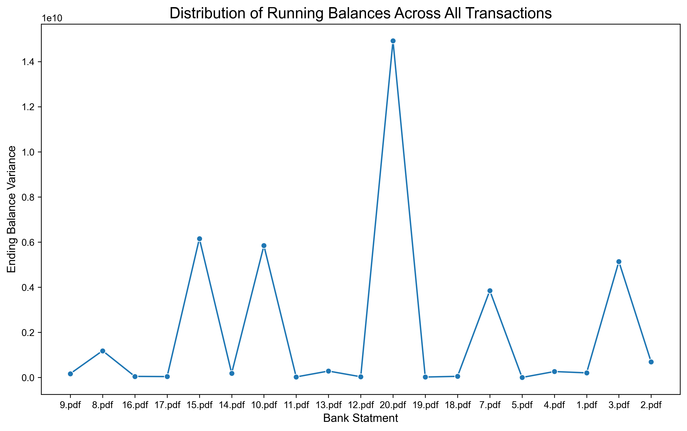

# Bank Statement Analyzer

Automate the **extraction, validation, and visualisation** of bank-statement PDFs.
1. Architecture lets you 
   1. Swap parsers (text / markdown / Google Drive) 
   2. Extraction strategies (regex / LLM-powered) 
   3. Downstream analytics.

---

##  Problem Statement

 Given N bank-statement as PDFs:
 1. **Extracts** every transaction into a clean JSON structure
 2. **Validates** `starting_balance + Σ(transactions) = ending_balance` 
    1. Reports Mismatch
 3. **Visualises** the variance of ending balances across all statements

---

##  High Level Code Flows  (`src/main.py`)


1. **Configuration** – `load_configs()` reads `config.json` (paths, LLM model, etc.).
2. **Parsing** - Reads Datasources, PDF in this case. Uses OCR.
   1. `PdfParser` scans `resources/data` and returns raw text for every PDF.
   2. `Pdf2MarkdownParser` scans `resources/data` and returns markdown for every PDF.
3. **Extraction** – `LLMExtractor` (or `VanillaExtractor`) converts raw text ➜ structured transaction statments JSON:

```json
[
   {
    "starting_balance": 2500.0,
    "ending_balance": 4230.25,
    "transactions": [
       { "date": "2024-01-02", "description": "Amazon", "amount": 499.99, "direction": "debit"}
    ],
    "discrepancy": "Some note"
   }
]
```

4. **Validation** – `VanillaValidator` recomputes the ending balance and flags any gap (≤ 10 tolerance by default).
5. **Visualisation** – `Visualizer.plot_balance_distribution()` draws a histogram of ending balances, stores it in `plots_output_dir`, and exposes variance statistics.
6. **Logging** – Every LLM call gets a timestamped JSON entry in `logs/` for full reproducibility.

Run it:
```bash
python -m src.main
```

Run all tests:
```bash
pytest
```


---

## 📂 Directory Structure

```
.
├── config.json               # Paths & runtime options
├── logs/                     # Time-stamped request/response logs from the LLM router
├── resources/
│   └── data/                 # 20 input PDFs
├── requirements.txt
└── src/
    ├── main.py               # Entry point (see flow above)
    ├── extraction/
    │   ├── Extractor.py          
    │   ├── LLMExtractor.py       # Uses LLM for JSON extractor
    │   └── VanillaExtractor.py   # Regex-based fallback extractor
    ├── parsers/
    │   ├── Parser.py             
    │   ├── PdfParser.py          # PyMuPDF plain-text parser
    │   ├── Pdf2MarkdownParser.py # marker-pdf → Markdown converter
    │   └── DrivePdfParser.py     # (stub) Google Drive integration
    ├── utils/
    │   ├── Constants.py          
    │   ├── LLMRouter.py          # LLM Access
    │   └── load_configs.py       
    ├── validation/
    │   ├── Validator.py          
    │   └── VanillaValidator.py   # Balance-check
    └── visualization/
        └── Visualizer.py         # Variance calc + seaborn plots
```


---

## 🏃‍♀️ Dev Start

> Host any LLM on `localhost:3000` following the [open-webui schema](https://docs.openwebui.com/getting-started/api-endpoints).
> This uses ollama and openwebui hosted on docker.

Setup ollama & openwebui
1. [Get & Run ollama models](https://ollama.com/download)
2. Run openweb-ui
```bash
pip install open-webui
open-webui serve
```
3. Generate API Key & update in `config.json` 
>Alternatively you may use OpenAI key and url in `config.json` if you like
4. Run

```bash
# 1. Install dependencies
python -m venv venv && source venv/bin/activate
pip install -r requirements.txt

# 2. Put your PDFs in resources/data/  (or update config.json)

# 3. Test
pytest

# 4. Run the pipeline
python -m src.main
```


---

## Results

### Test Set
1. 20 PDF documents.
2. Stored in `resources/data` directory.

### Parsing

| File | Purpose                                                 | Key Tech |
| :-- |:--------------------------------------------------------| :-- |
| `Parser.py` | Interface    |  |
| `PdfParser.py` | Fast text extraction using **PyMuPDF**                  | `pymupdf` |
| `Pdf2MarkdownParser.py` | High-fidelity layout via **marker-pdf** (Markdown)      | `marker-pdf`, `torch` |
| `DrivePdfParser.py` | Placeholder for reading PDFs directly from Google Drive | Google API |


### Extraction Result
1. OCR on PDF documents are used to convert to markdown.
2. Markdown performed best for inputs to LLM since it maintains formating & structure of PDF data.
3. Performs faster rather than feeding whole PDF to LLM.
4. Model used is `llama2-uncensored:latest`


| File | Purpose                                                                                         |
| :-- |:------------------------------------------------------------------------------------------------|
| `Extractor.py` | Interface                                                                                       |                                                                                              
| `VanillaExtractor.py` | Uses finely-tuned regex to pull columns (`date description debit credit …`)                     |
| `LLMExtractor.py` | Sends *prompt + markdown* to an LLM (see `utils/LLMRouter.py`), repairs JSON with `json_repair` |


### Validation Result

1. Depends on Accuracy of Extraction Stage.
2. For full validation results check `validation_results.xlsx` at `output/validation`
3. Console output

```
Scanning for PDF files in: 'resources/data'
Found 20 PDF file(s).

{
  "starting_balance": 2500.0,
  "ending_balance": 4230.25,
  "transactions": [
     { "date": "2024-01-02", "description": "Amazon", "amount": 499.99, "direction": "debit"},
     …
  ],
  "discrepancy": "Some note"
}

Validating for Bank: 16.pdf
! Statement has discrepancy
Calculated ending balance: -13783.34
Provided ending balance: 17998.79
Discrepancy: -31782.13
Total Credit: 173883.79
Total Debit: 157952.66
Discrepancy as % of transaction volume: 9.58%
Discrepancy note: Transaction for 'JACK IN THE BOX 8372' on 2023-05-21 has missing or invalid amount; please verify.
```


### Visualization

1. Calculates variance of `ending_balance` in continuous running fashion after each transaction.
2. Plots histogram for Variance of Ending Balances for each input.
3. Saves `balance_distribution.png` in `output/visuals`



---

## Extending the Project

1. **Add a new parser**
2. **Add extraction strategy**
3. **Plug in a different LLM**
Update `Model` enum values or `LLMRouter.API_URL / AUTH_TOKEN`.
4. **Extend Visualization**

---
